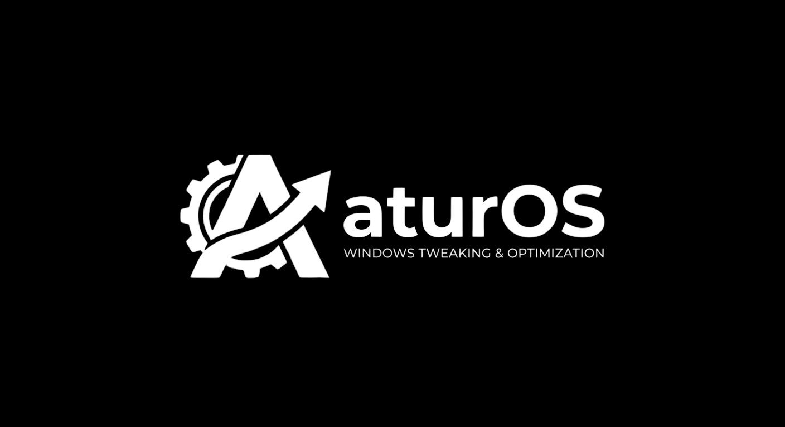

  

<h1 align="center">AturOS</h1>

  <strong>Utilitas Desktop Native Modern untuk Optimasi, Debloat, dan Kustomisasi Windows 10 &amp; Windows 11</strong>

  
  
  
  

---

## 🚀 Download & Cara Pakai

Aplikasi AturOS didistribusikan dalam bentuk **1 file siap pakai (`AturOS.exe`)**. Anda **tidak perlu menginstal .NET Runtime** dan **tidak perlu melakukan instalasi (Portable)**.

### 1. Unduh Aplikasi
Silakan unduh file aplikasi versi terbaru melalui tautan berikut:

👉 [**Download AturOS.exe (Halaman Releases)**](https://github.com/ariski254/AturOS/releases)

### 2. Cara Menjalankan
1. Klik ganda pada file `AturOS.exe` yang telah diunduh.
2. Saat muncul jendela konfirmasi hak akses Administrator (UAC), pilih **Yes** *(diperlukan agar AturOS dapat berinteraksi langsung dengan sistem Windows, membersihkan file, dan mengatur registri)*.
3. AturOS langsung terbuka dan siap digunakan!

> [!TIP]
> **100% Portabel:** Anda dapat meletakkan dan menjalankan file `AturOS.exe` langsung dari Desktop, Folder Download, maupun Flashdisk tanpa memerlukan folder file pendukung lainnya.

---

## ✨ Penjelasan Fitur

### 1. 📊 Ringkasan Sistem Real-Time (Dashboard)
* **Pantau Sumber Daya**: Membaca penggunaan CPU, pembagian kapasitas memori RAM (Terpakai, Bebas, Persentase), dan sisa penyimpanan drive C: secara langsung tanpa lag.
* **3 Profil Performa 1-Klik**:
  * 🌱 **Mode Seimbang (Daily Balance)**: Skema daya seimbang, animasi normal, hemat energi saat santai.
  * 💼 **Mode Kerja & Produktivitas**: Skema daya kerja dengan auto-trim RAM di latar belakang dan Focus Assist.
  * ⚡ **Mode Gaming (Extreme Latency & FPS)**: Skema daya *Ultimate Performance*, matikan CPU Core Parking, dan respon input instan.
* **Aksi Cepat**: Optimalkan RAM seketika, bersihkan file sementara, dan bersihkan riwayat clipboard.

### 2. 🪶 Mode Windows Lite (Pangkas Beban Sistem Berjenjang)
* **Tingkat 1 (Mode Ringan)**: Menghapus bloatware sponsor bawaan Windows (TikTok, Spotify, Candy Crush, Disney+), mematikan telemetri pelacak `DiagTrack`, widget taskbar, dan iklan Start Menu (~400–700 MB RAM dibebaskan).
* **Tingkat 2 (Mode Seimbang)**: Seluruh optimasi Tingkat 1 + mencopot aplikasi UWP sekunder (Cuaca, Berita, Peta, Solitaire), mematikan Cortana & Copilot, serta mematikan servis `SysMain` & `WSearch` (~1.2–2.0 GB RAM dibebaskan).
* **Tingkat 3 (Mode Ekstrem - Barebone)**: Pangkas tuntas beban sistem untuk PC spek rendah dan gaming kompetitif. Mencopot Microsoft Edge & Edge Update, mengaktifkan kompresi sistem *CompactOS*, mematikan hibernasi, dan menyisakan hanya aplikasi esensial (~2.5–3.5+ GB RAM dibebaskan).
* **Fitur Pemulihan (Revert)**: 1-klik untuk mengembalikan seluruh servis, efek visual, dan setelan ke kondisi bawaan pabrik Windows.

### 3. 📦 Semua Aplikasi Terinstall (App Debloater)
* **Pindai Menyeluruh**: Menampilkan seluruh aplikasi yang terpasang di komputer Anda, baik aplikasi desktop klasik (**Win32 / x64 / x86**) maupun aplikasi modern (**UWP / Windows Store**).
* **Pencarian & Filter Cepat**: Cari nama aplikasi secara instan atau filter berdasarkan kategori.
* **Copot Bersih**: Menjalankan proses uninstaller resmi aplikasi atau pencopotan paket sistem secara aman.

### 4. 🧹 Pembersih Drive (Storage Cleaner)
* **Pembersihan File Sampah**: Memindai dan menghapus berkas sementara di `%TEMP%`, `C:\Windows\Temp`, `SoftwareDistribution\Download`, `Prefetch`, Crash Dumps, Thumbnails, dan log sistem lama.
* **Kompresi Sistem (CompactOS)**: Mengaktifkan kompresi biner sistem Windows (`compact.exe /compactos:always`) untuk menghemat 3–5 GB ruang penyimpanan.
* **Manajemen Hibernasi**: Matikan file hibernasi `hiberfil.sys` untuk membebaskan ruang disk sebesar kapasitas RAM fisik Anda.
* **Penyimpanan Cadangan (Reserved Storage)**: Bebaskan ~7 GB ruang disk yang dicadangkan oleh Windows Update.
* **Penyimpanan Pintar (Storage Sense) & NTFS Last Access**: Otomasi pembersihan ruang dan pengurangan beban penulisan I/O untuk memperpanjang umur SSD.

### 5. ⚡ Optimasi RAM Mendalam
* **Bebaskan RAM Sekarang**: Memangkas alokasi working set proses yang idle menggunakan Windows API native tanpa mematikan aplikasi secara paksa.
* **Bersihkan Standby List & Cache**: Mengosongkan cache memori standby sistem yang menumpuk.
* **Kunci Kernel di RAM Fisik (`DisablePagingExecutive`)**: Memaksa modul kernel dan driver tetap berada di RAM fisik agar respon sistem tidak terhambat oleh kecepatan disk.
* **Bersihkan Pagefile saat Shutdown**: Menghapus residu memori virtual saat komputer dimatikan.
* **Kompresi Memori Windows (MMAgent)**: Atur kompresi memori untuk menghemat RAM (PC spek rendah) atau menghemat siklus prosesor CPU (PC gaming).

### 6. 🎮 Tuning Hardware & Gaming
* **Skema Daya Ultimate Performance**: Mengaktifkan profil performa tertinggi Windows tanpa batasan throttling daya.
* **Prioritas CPU Aplikasi Aktif (`Win32PrioritySeparation`)**: Nilai optimal `38` (`0x26`) untuk alokasi siklus prosesor maksimum pada game atau software yang sedang aktif.
* **Respon Menu Instan (`MenuShowDelay`)**: Menghilangkan jeda bawaan 400ms Windows saat membuka klik-kanan dan menu menjadi `0 ms`.
* **Prioritas GPU & Latensi Jaringan**: Optimasi alokasi scheduler task GPU (`Games`), bebaskan Network Throttling Index, dan matikan algoritma Nagle (TCPNoDelay).
* **Respon Input 1:1**: Nonaktifkan akselerasi mouse Windows untuk presisi bidikan murni dan maksimalkan responsivitas ketikan keyboard.

### 7. 🩺 Dokter Sistem & Auto-Repair
* **Integritas Berkas (SFC & Auto-DISM)**: Menjalankan pemindaian `sfc /scannow`. Jika ditemukan kerusakan komponen yang gagal diperbaiki oleh SFC, otomatis menjalankan pemulihan citra komponen via `dism /Online /Cleanup-Image /RestoreHealth`.
* **Troubleshooter Windows Update**: 1-klik mereset folder antrian `SoftwareDistribution` dan `Catroot2` serta merestart layanan update yang macet.
* **Perbaikan Tumpukan Jaringan**: Reset Winsock, reset TCP/IP stack, dan pembersihan DNS cache untuk mengatasi internet bermasalah.
* **Pemeriksa Dependensi (.DLL Missing)**: Mendeteksi dan memasang pustaka runtime esensial (Visual C++ 2015–2022, DirectX, dan .NET Runtime) dengan 1-klik.
* **Pembersih Shortcut Rusak & Registry Bekas**: Memindai file `.lnk` yang targetnya telah dihapus dan membersihkan sisa entri uninstaller registry lama.

### 8. 🌐 Pengoptimal Jaringan & DNS
* **1-Click DNS Switcher**: Beralih ke DNS cepat dan aman dengan pilihan preset terpercaya:
  * Cloudflare DNS (`1.1.1.1` & `1.0.0.1`)
  * Google Public DNS (`8.8.8.8` & `8.8.4.4`)
  * AdGuard DNS (`94.140.14.14` & `94.140.15.15`) — Blokir Iklan & Pelacak
  * Quad9 DNS (`9.9.9.9` & `149.112.112.112`) — Keamanan Malware
* **Tes Latensi DNS**: Mengukur kecepatan respon ping real-time untuk memilih server DNS tercepat untuk koneksi Anda.
* **Kembalikan ke DHCP**: 1-klik mereset DNS kembali ke setelan otomatis bawaan router / ISP.

### 9. 📁 Kustomisasi Shell & File Explorer
* **Menu Konteks Klasik Windows 11**: Mengembalikan menu klik-kanan klasik Windows 10 tanpa submenu "Show more options".
* **Tampilkan Ekstensi & File Tersembunyi**: Menampilkan ekstensi file dan folder tersembunyi secara permanen.
* **Hapus Teks "- Shortcut"**: Menghilangkan imbuhan kata saat membuat pintasan baru.
* **Pintasan Praktis**: Menambahkan opsi *Take Ownership* dan *Buka Terminal sebagai Administrator* pada klik-kanan berkas dan folder.

### 10. 🛡️ Kontrol Windows Update
* **Pilihan Mode Kontrol**:
  * **Hentikan Total (Hard Lockdown)**: Mematikan seluruh servis update dan Task Scheduler otomatis.
  * **Jeda Jangka Panjang (Hingga 2099)**: Menjeda pembaruan Windows tanpa merusak fungsionalitas Microsoft Store.
  * **Mode Patch Keamanan Saja**: Hanya mengizinkan unduhan update keamanan penting tanpa update fitur besar yang berat.
  * **Kembalikan ke Default**: Mengembalikan seluruh setelan update ke standar bawaan Windows.

### 11. 🚀 Pemasang Aplikasi Massal (Winget GUI)
* Memasang software esensial (7-Zip, Notepad++, Git, Google Chrome, Brave, Discord, Steam, OBS Studio, PowerToys, dll.) secara otomatis tanpa iklan atau installer manual melalui antarmuka visual terintegrasi `winget`.

### 12. 🔒 Backup & Restore
* **System Restore Point**: Membuat titik pemulihan sistem Windows via PowerShell `Checkpoint-Computer` sebelum menerapkan perubahan besar.
* **Buka Wizard Pemulihan**: Peluncur 1-klik untuk membuka wizard pemulihan resmi Windows (`rstrui.exe`).
* **Cadangan Registri (.reg)**: Ekspor dan simpan backup konfigurasi registri ke folder cadangan lokal.
